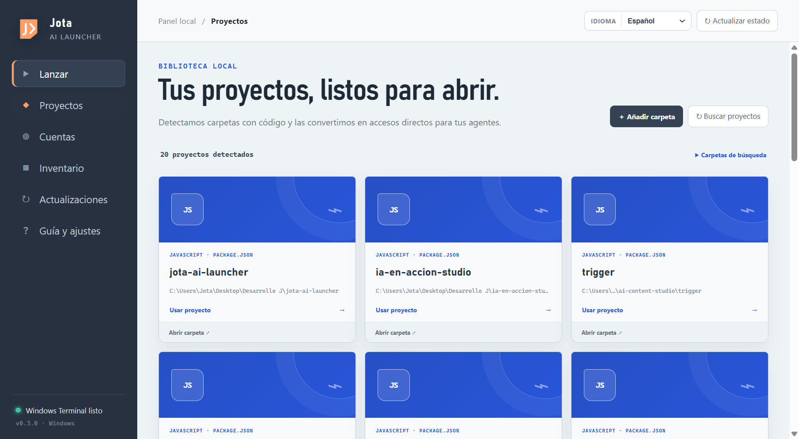
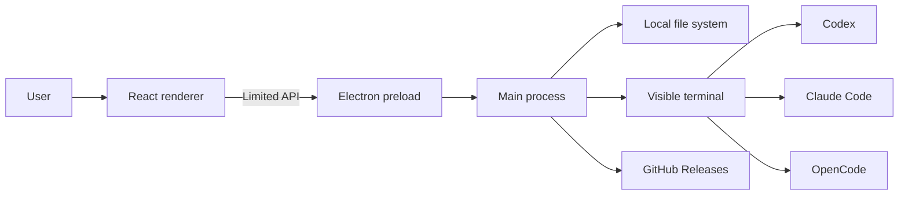

<div align="center">

# Jota AI Launcher

### Codex, Claude Code, and OpenCode. All your projects. One dashboard.

[](./README.md)
[](./README.en.md)

[](https://github.com/JotaEse68/jota-ai-launcher/actions/workflows/ci.yml)
[](https://github.com/JotaEse68/jota-ai-launcher/actions/workflows/codeql.yml)
[](https://github.com/JotaEse68/jota-ai-launcher/releases/latest)
[](https://github.com/JotaEse68/jota-ai-launcher/releases)
[](./LICENSE)

A local, multilingual, open-source desktop application for Windows and macOS.

[⬇ Download for Windows (.exe)](https://github.com/JotaEse68/jota-ai-launcher/releases/download/v0.5.0/Jota-AI-Launcher-Setup-0.5.0.exe) · [⬇ Download for macOS (.dmg)](https://github.com/JotaEse68/jota-ai-launcher/releases/download/v0.5.0/Jota-AI-Launcher-0.5.0-universal.dmg)

[Discover Jota AI Launcher](https://jotaese68.github.io/jota-ai-launcher/en/) · [View every release file](https://github.com/JotaEse68/jota-ai-launcher/releases/latest) · [How we built it with Codex (Spanish)](./docs/PROCESO-DE-CREACION.md) · [Verify a download](#verify-a-downloaded-file) · [Report a vulnerability](https://github.com/JotaEse68/jota-ai-launcher/security/advisories/new)

</div>


## OpenAI Build Week 2026

Jota AI Launcher was designed and implemented during the OpenAI Build Week submission period. The first repository commit was created on July 18, 2026, and the product evolved through six public releases in less than two days.
The Devpost entry may reflect the state submitted at that time; GitHub is the living project record and documents later improvements.

The project was built collaboratively by Jota Santos and Codex using **GPT-5.6 Sol with high reasoning**. Jota supplied the real problem, product direction, priorities, language, and acceptance decisions. Codex translated that direction into product requirements, Electron architecture, React and TypeScript implementation, tests, security hardening, documentation, GitHub workflows, releases, and the bilingual landing page.

GPT-5.6 was particularly useful for work that crossed several layers at once:

- turning an initial three-button launcher into a local project-memory system;
- designing a safe Electron boundary between the renderer, IPC bridge, file system, and visible terminals;
- recognizing stacks, repositories, deployment providers, WordPress projects, and local AI-assisted work without uploading source code;
- tracing a CodeQL URL-validation finding to its root cause, fixing it, and adding adversarial regression tests;
- coordinating Windows and macOS packaging, checksums, SBOMs, provenance, documentation, and release verification.

Jota AI Launcher does not pretend that GPT-5.6 is an invisible runtime dependency. It is a desktop developer tool **built with Codex and GPT-5.6**. At runtime it launches the user's own installed Codex CLI and preserves each person's existing account, permissions, settings, and credentials.

Watch the [public Build Week video demo](https://youtu.be/Y2yW0IPqUFc) and read the complete [OpenAI Build Week submission and testing guide](./docs/OPENAI-BUILD-WEEK.md), including the development timeline, technical decisions, judging path, and public evidence.

### What v0.6.0 adds

- **Projects that are ready to open:** every card identifies whether it is a web app, desktop app, plugin, theme, library, service, website, or folder.
- **Immediate public destination:** detects Vercel, Netlify, Render, Railway, Cloudflare, Firebase, and GitHub Pages deployments, allows corrections, and clearly shows when a project is not published yet.
- **Folders by text or voice:** paste or dictate a path to choose where the launcher should search for projects.
- **A controllable library:** hide cards without deleting files and restore them later from the search-locations menu.
- **New Cleanup section:** inspects dependencies, caches, logs, builds, and empty folders while separating source code and protected configuration.
- **Recoverable cleanup:** scanning never deletes anything; the final selection requires confirmation and goes to the system recycle bin.
- **Security and tests:** microphone access is audio-only and limited to the main window, paths cross a validated IPC boundary, and dedicated tests cover public links and cleanup classification.

Version `0.6.0` extends the existing library without removing Finish Desk, focus projects, checkpoints, or any other capability introduced in `0.5.0`.

### What improved in v0.5.0

- **Finish Desk:** turns a project into a concrete work plan with an objective, next action, definition of done, phase, and deadline.
- **Focus projects:** keeps up to three priority projects visible so context is not lost between sessions.
- **Session tracking:** saves checkpoints and lets users intentionally abandon a plan when it is no longer useful.
- **Better search:** combines fuzzy matching, status filters, and sorting to find projects quickly.
- **Robustness:** adds strict date validation and a dependency audit with no high-severity vulnerabilities.

These improvements are documented in GitHub as the application's ongoing evolution; the Build Week video does not need to show every current feature.

## What is Jota AI Launcher?

Jota AI Launcher brings **Codex**, **Claude Code**, and **OpenCode** into a single desktop application. It detects installed tools, launches each agent in the correct folder, displays versions, accounts, plugins, skills, and MCP servers, and maintains a visual library of your local projects.

The launcher does not replace the agents or proxy communication between them and their providers. Its job is to provide a clear and secure entry point: choose a project, choose an agent, and get a terminal that is ready to work.

### Highlights

- One interface for Codex, Claude Code, and OpenCode.
- Visual library that summarizes each project's purpose, stack, GitHub repository, and deployment.
- Direct public link on every card, with Vercel, Netlify, and other destinations detected automatically or edited manually.
- Cleanup inspector that separates safe leftovers, review-required output, and protected content before moving anything to the recycle bin.
- Finish Desk for turning open-ended projects into concrete, finishable plans.
- Local app, plugin, and folder detection even when no repository exists.
- Automatic detection of versions, accounts, plugins, skills, and MCP servers.
- Installation and updates through each CLI's official commands.
- Spanish, English, French, Portuguese, Italian, and German.
- Windows and macOS support.
- No proprietary server, advertising, analytics, or telemetry.
- No passwords, API keys, or user accounts embedded in the installer.
- Public source, builds, checksums, SBOMs, and provenance.

## Download and installation

Always download Jota AI Launcher from the official [GitHub Releases page](https://github.com/JotaEse68/jota-ai-launcher/releases/latest).

| Operating system | File | Compatibility | Terminal used |
|---|---|---|---|
| Windows | [Download `Jota-AI-Launcher-Setup-0.5.0.exe`](https://github.com/JotaEse68/jota-ai-launcher/releases/download/v0.5.0/Jota-AI-Launcher-Setup-0.5.0.exe) | Windows 10/11 x64 | Windows Terminal or PowerShell |
| macOS | [Download `Jota-AI-Launcher-0.5.0-universal.dmg`](https://github.com/JotaEse68/jota-ai-launcher/releases/download/v0.5.0/Jota-AI-Launcher-0.5.0-universal.dmg) | Intel and Apple Silicon Macs | Terminal |

### Windows

1. [Download `Jota-AI-Launcher-Setup-0.5.0.exe` directly](https://github.com/JotaEse68/jota-ai-launcher/releases/download/v0.5.0/Jota-AI-Launcher-Setup-0.5.0.exe).
2. Confirm that the file comes from the official `v0.5.0` release.
3. Verify its checksum or provenance using the instructions below.
4. Run the installer and choose an installation location.
5. Open **Jota AI Launcher** from the desktop or Start menu.

The installer creates shortcuts and installs the application for the current user only. A normal installation does not require administrator privileges.

### macOS

1. [Download `Jota-AI-Launcher-0.5.0-universal.dmg` directly](https://github.com/JotaEse68/jota-ai-launcher/releases/download/v0.5.0/Jota-AI-Launcher-0.5.0-universal.dmg).
2. Confirm that the file comes from the official `v0.5.0` release.
3. Verify its SHA-256 checksum and provenance before opening it.
4. Mount the `.dmg` and move **Jota AI Launcher** to Applications.
5. Start the application from Applications.

> **Signing notice:** the installers do not yet have commercial Microsoft and Apple code-signing certificates. Windows SmartScreen may show “Unknown publisher,” and macOS Gatekeeper may prevent the first launch. Download only from this repository and complete the verification steps. Signing and notarization are planned for future releases.

## Quick start

1. Open the launcher. It checks local tools and projects.
2. Open **Projects** and choose a card, or manually select a folder from **Launch**.
3. If an agent is missing, click **Install**. The launcher opens a terminal with its official command.
4. Open **Accounts** and sign in directly with the relevant provider.
5. Click **Start** or **Resume session** for Codex, Claude Code, or OpenCode.

The terminal opens inside the selected project. Each agent retains its own permissions, history, settings, and credentials.

## Visual project library

The **Projects** section acts as a local memory for your work. It scans common development locations, reads the first useful description from each README, and turns every folder into a card that reminds you what it did, how it was built, and where it was deployed.



### Available actions

- **Use project:** makes the folder the active project and returns to the launch dashboard.
- **Open folder:** opens the project in Windows Explorer or Finder.
- **GitHub:** opens the repository when a valid remote is detected.
- **View live:** opens the deployed app directly; cards without a link let you add Vercel, Netlify, or a custom domain.
- **Remove card:** hides a project from the library without deleting its folder; hidden cards can be restored.
- **Add folder:** includes another root folder where you keep projects.
- **Type or dictate a path:** adds a search location by pasting its path or using the microphone.
- **Remove folder:** stops scanning a manually added location.
- **Find projects:** scans configured folders again.
- **Plan in Finish Desk:** define the next step, phase, deadline, and definition of done.
- **Save checkpoints:** record session progress and resume it later.

### Detected technologies

| Technology | File or marker |
|---|---|
| JavaScript / TypeScript | `package.json` |
| Python | `pyproject.toml` or `requirements.txt` |
| Rust | `Cargo.toml` |
| Go | `go.mod` |
| .NET | `.sln` or `.csproj` |
| PHP | `composer.json` |
| Ruby | `Gemfile` |
| Other repositories | `.git` |

Cards also recognize common frameworks and services: React, Next.js, Vue, Nuxt, Svelte, Astro, Electron, Vite, Tailwind CSS, Supabase, Firebase, WordPress, Vercel, Netlify, Render, Railway, Cloudflare, and Docker. A project without Git still appears as a **Local folder** when it contains a README, code, a plugin, or recognizable design files.

## Safe folder cleanup

The **Cleanup** section analyzes a previously selected folder and groups its contents into three states:

- **Safe:** dependencies, caches, and logs that can normally be regenerated.
- **Review:** builds, release output, and empty folders that may still be useful.
- **Protected:** source code, Git data, manifests, environment files, and other items the launcher does not allow you to select.

The scan never deletes anything. Only safe or review-required items can be selected and, after a native confirmation, they are moved to the system recycle bin so they remain recoverable.

The scan skips dependencies and generated output such as `node_modules`, `dist`, `build`, `release`, `.next`, `.nuxt`, `.venv`, `vendor`, `target`, `coverage`, and `.git`. To build each card it reads only bounded local metadata: README files, manifests, file names, and the Git remote. None of this information leaves the computer.

## Supported tools

| Tool | Official package | Start | Resume |
|---|---|---|---|
| Codex | `@openai/codex` | `codex` | `codex resume` |
| Claude Code | `@anthropic-ai/claude-code` | `claude` | `claude --resume` |
| OpenCode | `opencode-ai` | `opencode` | `opencode --continue` |

Jota AI Launcher can:

- Detect whether each command is available.
- Display the installed version and look up the latest published version.
- Open installation, update, sign-in, and sign-out commands in a visible terminal.
- Read the general authentication status reported by each CLI.
- Inventory plugins, skills, and MCP servers when supported by the tool.
- Open official documentation and account-management pages.

The tools are not bundled with the launcher. To install them through `npm`, you need a compatible version of **Node.js and npm**.

## Accounts and credentials

Each agent manages its own account. The launcher has no form for entering passwords or API keys, and it never copies credentials between tools.

- Codex stores its session in the user's profile according to its official CLI.
- Claude Code stores access according to its official CLI.
- OpenCode stores providers and credentials according to its official configuration.
- When the installer is shared, the other person starts without your accounts.
- A separate operating-system account is recommended for each person on a shared computer.

## Languages

The interface is available in:

- Español
- English
- Français
- Português
- Italiano
- Deutsch

A new installation uses the system language when it is supported. The language can then be changed from the top selector, and the preference is stored locally. Technical output from each CLI may use the language configured by its provider.

## Application sections

| Section | Purpose |
|---|---|
| Launch | Choose the active project and start an agent |
| Projects | Browse the local project library |
| Cleanup | Inspect leftovers and move a reviewed selection to the recycle bin |
| Accounts | View access status and open sign-in/sign-out flows |
| Inventory | Inspect plugins, skills, and MCP servers |
| Updates | Compare versions and open official updaters |
| Guide & settings | Preferences, launch at login, and official links |

## Privacy

Jota AI Launcher runs locally. It has no proprietary backend, remote database, advertising, analytics, or usage telemetry.

| Information it may read locally | Information it does not collect |
|---|---|
| Presence and version of the three CLIs | Passwords |
| Node.js and the available terminal | API keys |
| General authentication status | Session tokens |
| Names and paths of detected projects | Project source code |
| Installed plugins, skills, and MCP servers | Conversation content |
| Launcher preferences | Account email addresses |

This inventory is not transmitted to Jota or to a project-owned server. When an agent runs, communication happens directly between that CLI and its provider. See the [privacy policy](./PRIVACY.md).

## Security and trust

No single scan can guarantee that an application is malware-free. Releases therefore combine several verifiable controls:

- **Open source:** the complete source code is available in this repository.
- **Public builds:** Windows and macOS packages are built by GitHub Actions.
- **Public tests:** every change is checked on both operating systems.
- **Provenance attestations:** each installer is linked to the workflow and commit that produced it.
- **SHA-256:** `SHA256SUMS.txt` detects modified files.
- **SBOM:** every release includes a CycloneDX dependency inventory.
- **Independent scanning:** public installers can be checked with Microsoft Defender or [VirusTotal](https://www.virustotal.com/gui/home/upload).
- **Private reporting:** vulnerabilities can be submitted through [GitHub Security Advisories](https://github.com/JotaEse68/jota-ai-launcher/security/advisories/new).

### Verify a downloaded file

Windows PowerShell:

```powershell
Get-FileHash -Algorithm SHA256 ".\Jota-AI-Launcher-Setup-0.5.0.exe"
Get-Content ".\SHA256SUMS.txt"
gh attestation verify ".\Jota-AI-Launcher-Setup-0.5.0.exe" --repo JotaEse68/jota-ai-launcher
```

macOS Terminal:

```shell
shasum -a 256 Jota-AI-Launcher-0.5.0-universal.dmg
cat SHA256SUMS.txt
gh attestation verify Jota-AI-Launcher-0.5.0-universal.dmg --repo JotaEse68/jota-ai-launcher
```

The calculated value must match `SHA256SUMS.txt`. An attestation proves where a file came from; it does not replace a security review. See the [download verification guide](./docs/VERIFICAR.md), the [version 0.4.0 security review](./docs/SECURITY-REVIEW.en.md), and the [security policy](./SECURITY.md) for more details.

## Architecture



- The renderer has no direct access to Node.js.
- Electron context isolation and sandboxing are enabled.
- The preload exposes only specific operations through `contextBridge`.
- Every IPC request must come from the main window, and the main process validates its data.
- Tool actions are restricted to a known list of commands.
- External links are restricted to official domains.
- Usable paths may only come from validated settings, controlled scanning, or native operating-system dialogs.
- Web permissions, new windows, navigation, and `webview` attachment are denied.

## Updates

The launcher handles two update categories:

1. **Tools:** it checks Codex, Claude Code, and OpenCode versions. Updating opens a visible terminal with the official command.
2. **Application:** `electron-updater` checks this repository's public releases and notifies the user when a new version is available.

Tool installers are never run invisibly.

## Local development

### Requirements

- Node.js and npm.
- Windows or macOS.
- Git for cloning the repository.

### Setup

```shell
git clone https://github.com/JotaEse68/jota-ai-launcher.git
cd jota-ai-launcher
npm install
npm run dev
```

### Commands

| Command | Purpose |
|---|---|
| `npm run dev` | Start Vite and Electron in development mode |
| `npm run typecheck` | Check TypeScript for the main and renderer processes |
| `npm test` | Build the main process and run tests |
| `npm run build` | Create a production build |
| `npm run dist:win` | Create the Windows NSIS installer |
| `npm run dist:mac` | Create universal macOS `.dmg` and `.zip` packages |

### Project structure

```text
src/
├── main/       Main process, terminals, scanning, and updates
├── renderer/   React interface, styles, and translations
└── shared/     Types for the secure bridge between both processes
tests/          Tool and project-discovery tests
docs/           Download verification guides
.github/        CI, releases, and dependency updates
```

## Release pipeline

Every `v*` tag starts a public workflow that:

1. Installs dependencies with `npm ci`.
2. Runs tests and TypeScript checks.
3. Builds the `.exe` on a Windows runner.
4. Builds the universal `.dmg` on a macOS runner.
5. Generates a CycloneDX SBOM.
6. Creates provenance attestations.
7. Calculates SHA-256 checksums.
8. Publishes all assets to GitHub Releases.

## Troubleshooting

### A tool is missing

Check that its command works in a new terminal:

```shell
codex --version
claude --version
opencode --version
```

If you just installed the tool, restart the launcher so it receives the updated `PATH`.

### A project is missing

- Select **Projects → Add folder** and choose the directory that contains your projects.
- Make sure the project contains a supported marker file.
- Click **Find projects** after creating or moving folders.
- Generated and dependency folders are intentionally ignored.

### The terminal opens in the wrong folder

Return to **Projects**, click **Use project** on the correct card, and then launch the agent.

### Windows or macOS displays a warning

Download only from Releases, compare the SHA-256 checksum, verify the attestation, and scan the file. The application does not yet have commercial code-signing certificates.

### An account appears disconnected

Open **Accounts** and start the sign-in flow. Authentication happens in the provider's official terminal flow, not inside the launcher.

## Frequently asked questions

### Does the installer contain the developer's accounts?

No. Every installation starts without another person's accounts, and every CLI manages its own credentials.

### Do I need API keys?

That depends on the tool and provider you choose. The launcher itself neither requires nor stores an API key.

### Does it read my project source code?

It does not analyze or index source code. To build each card it reads file names, manifests, the first useful README description, WordPress plugin or theme headers, and the GitHub remote URL. Everything is processed locally and is never sent to the author.

### Does it work offline?

The project library and local inventory work offline. Installation, updates, sign-in, and model use require the connectivity expected by each provider.

### Can I share the installer?

Yes. Prefer sharing the official release link so each person can verify provenance and receive future updates.

## Contributing and support

- Open an [issue](https://github.com/JotaEse68/jota-ai-launcher/issues) for bugs or feature requests.
- Use the [private security channel](https://github.com/JotaEse68/jota-ai-launcher/security/advisories/new) for vulnerabilities.
- Before submitting changes, run `npm test`, `npm run build`, and the dependency audit.
- Never post credentials, tokens, private paths, or exploitable details in public issues.

## Official sources

- [Codex CLI](https://developers.openai.com/codex/cli/)
- [Claude Code](https://code.claude.com/docs/en/setup)
- [OpenCode](https://opencode.ai/docs/)
- [Jota AI Launcher GitHub Releases](https://github.com/JotaEse68/jota-ai-launcher/releases)

## License

Jota AI Launcher is distributed under the [MIT License](./LICENSE).

---

<div align="center">

Built to open the right project with the right agent—without sharing your credentials.

[**by Jota!**](https://jsantos.pro/)

[iapacks.com · Premium WordPress Plugins & Tools · Built by Jota Santos](https://iapacks.com/)

[GitHub · @JotaEse68](https://github.com/JotaEse68)

[⬆ Back to top](#jota-ai-launcher)

</div>
