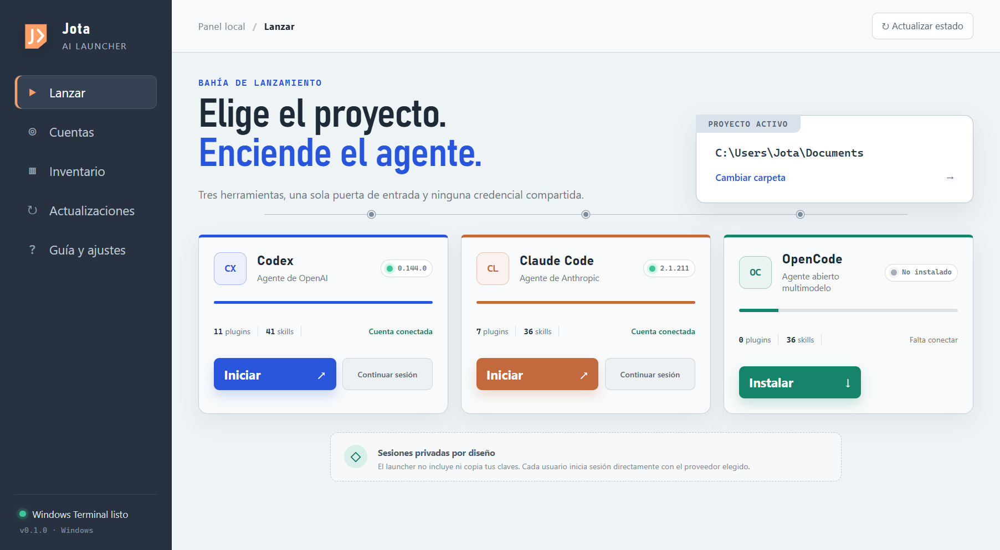

# Jota AI Launcher

Aplicación de escritorio para Windows que detecta, inicia y mantiene Codex, Claude Code y OpenCode desde una sola interfaz.



## Privacidad

El instalador no contiene cuentas, contraseñas ni claves API. Cada CLI gestiona sus credenciales en el perfil del usuario de Windows. Para un ordenador compartido, se recomienda una cuenta de Windows por persona.

## Desarrollo

```powershell
npm install
npm run dev
```

## Instalador

```powershell
npm run dist:win
```

El instalador se genera en `release/Jota-AI-Launcher-Setup-0.1.0.exe`.

## Actualizaciones

El panel comprueba las versiones de los tres CLI y abre sus actualizadores oficiales en PowerShell. La actualización automática del propio launcher queda preparada para GitHub Releases y se activa al publicar la primera versión del repositorio `JotaEse68/jota-ai-launcher`.

## Fuentes oficiales

- Codex: https://developers.openai.com/codex/cli/
- Claude Code: https://code.claude.com/docs/en/setup
- OpenCode: https://opencode.ai/docs/
