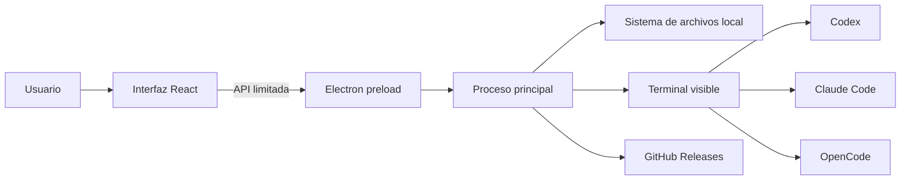

<div align="center">

# Jota AI Launcher

### Codex, Claude Code y OpenCode. Todos tus proyectos. Un solo panel.

[](./README.md)
[](./README.en.md)

[](https://github.com/JotaEse68/jota-ai-launcher/actions/workflows/ci.yml)
[](https://github.com/JotaEse68/jota-ai-launcher/actions/workflows/codeql.yml)
[](https://github.com/JotaEse68/jota-ai-launcher/releases/latest)
[](https://github.com/JotaEse68/jota-ai-launcher/releases)
[](./LICENSE)

Aplicación de escritorio local, multilingüe y de código abierto para Windows y macOS.

[⬇ Descargar para Windows (.exe)](https://github.com/JotaEse68/jota-ai-launcher/releases/download/v0.4.0/Jota-AI-Launcher-Setup-0.4.0.exe) · [⬇ Descargar para macOS (.dmg)](https://github.com/JotaEse68/jota-ai-launcher/releases/download/v0.4.0/Jota-AI-Launcher-0.4.0-universal.dmg)

[Conocer Jota AI Launcher](https://jotaese68.github.io/jota-ai-launcher/) · [Ver todos los archivos de la release](https://github.com/JotaEse68/jota-ai-launcher/releases/latest) · [Cómo lo construimos con Codex](./docs/PROCESO-DE-CREACION.md) · [Verificar una descarga](./docs/VERIFICAR.md) · [Informar de una vulnerabilidad](https://github.com/JotaEse68/jota-ai-launcher/security/advisories/new)

</div>


## Qué es Jota AI Launcher

Jota AI Launcher reúne **Codex**, **Claude Code** y **OpenCode** en una única aplicación de escritorio. Detecta qué herramientas están instaladas, abre cada agente en la carpeta correcta, muestra sus versiones, cuentas, plugins, skills y servidores MCP, y mantiene una biblioteca visual con tus proyectos locales.

El launcher no sustituye a los agentes ni actúa como intermediario entre ellos y sus proveedores. Su trabajo es darte un punto de entrada claro y seguro: eliges un proyecto, eliges un agente y la terminal se abre preparada para trabajar.

### Lo más importante

- Una sola interfaz para Codex, Claude Code y OpenCode.
- Biblioteca visual que resume propósito, stack, GitHub y despliegue de cada proyecto.
- Detección de apps, plugins y carpetas locales aunque no tengan repositorio.
- Detección automática de versiones, cuentas, plugins, skills y MCP.
- Instalación y actualización mediante los comandos oficiales de cada CLI.
- Español, inglés, francés, portugués, italiano y alemán.
- Compatible con Windows y macOS.
- Sin servidor propio, publicidad, analítica ni telemetría.
- Sin contraseñas, claves API o cuentas incluidas en el instalador.
- Código, compilaciones, checksums, SBOM y procedencia públicos.

## Descarga e instalación

Descarga siempre desde la página oficial de [GitHub Releases](https://github.com/JotaEse68/jota-ai-launcher/releases/latest).

| Sistema | Archivo | Compatibilidad | Terminal utilizada |
|---|---|---|---|
| Windows | [Descargar `Jota-AI-Launcher-Setup-0.4.0.exe`](https://github.com/JotaEse68/jota-ai-launcher/releases/download/v0.4.0/Jota-AI-Launcher-Setup-0.4.0.exe) | Windows 10/11 x64 | Windows Terminal o PowerShell |
| macOS | [Descargar `Jota-AI-Launcher-0.4.0-universal.dmg`](https://github.com/JotaEse68/jota-ai-launcher/releases/download/v0.4.0/Jota-AI-Launcher-0.4.0-universal.dmg) | Mac Intel y Apple Silicon | Terminal |

### Windows

1. [Descarga directamente `Jota-AI-Launcher-Setup-0.4.0.exe`](https://github.com/JotaEse68/jota-ai-launcher/releases/download/v0.4.0/Jota-AI-Launcher-Setup-0.4.0.exe).
2. Comprueba que el archivo procede de la release oficial `v0.4.0`.
3. Comprueba el hash o la atestación siguiendo la [guía de verificación](./docs/VERIFICAR.md).
4. Ejecuta el instalador y elige la ubicación.
5. Abre **Jota AI Launcher** desde el escritorio o el menú Inicio.

El instalador crea accesos directos y se instala únicamente para el usuario actual. No necesita permisos de administrador para una instalación normal.

### macOS

1. [Descarga directamente `Jota-AI-Launcher-0.4.0-universal.dmg`](https://github.com/JotaEse68/jota-ai-launcher/releases/download/v0.4.0/Jota-AI-Launcher-0.4.0-universal.dmg).
2. Comprueba que el archivo procede de la release oficial `v0.4.0`.
3. Comprueba su SHA-256 y procedencia antes de abrirlo.
4. Monta el `.dmg` y mueve **Jota AI Launcher** a Aplicaciones.
5. Inicia la aplicación desde Aplicaciones.

> **Firma pendiente:** los instaladores todavía no tienen certificados comerciales de Microsoft y Apple. Windows SmartScreen puede mostrar “Editor desconocido” y macOS Gatekeeper puede impedir la primera apertura. Descarga únicamente desde este repositorio y realiza las verificaciones indicadas. El objetivo del proyecto es firmar y notarizar futuras versiones.

## Primeros pasos

1. Abre el launcher. La aplicación comprueba las herramientas y proyectos locales.
2. Entra en **Proyectos** y elige una tarjeta, o selecciona manualmente una carpeta desde **Lanzar**.
3. Si el agente no está instalado, pulsa **Instalar**. El launcher abrirá la terminal con su comando oficial.
4. En **Cuentas**, inicia sesión directamente con el proveedor correspondiente.
5. Pulsa **Iniciar** o **Continuar sesión** en Codex, Claude Code u OpenCode.

La terminal se abre dentro del proyecto seleccionado. El agente conserva sus propios permisos, historial, configuración y credenciales.

## Biblioteca visual de proyectos

La sección **Proyectos** funciona como una memoria local de tu trabajo. Busca proyectos en ubicaciones de desarrollo habituales, lee la primera descripción útil de su README y convierte cada carpeta en una ficha que permite recordar para qué servía, con qué se construyó y dónde está publicada.


### Acciones disponibles

- **Usar proyecto:** convierte esa carpeta en el proyecto activo y vuelve al panel de lanzamiento.
- **Abrir carpeta:** abre el proyecto en el Explorador de Windows o Finder.
- **GitHub:** abre el repositorio cuando se detecta un remoto válido.
- **Añadir carpeta:** incorpora otra carpeta raíz donde guardes proyectos.
- **Quitar carpeta:** deja de buscar dentro de una ubicación añadida manualmente.
- **Buscar proyectos:** vuelve a escanear las carpetas configuradas.

### Tecnologías detectadas

| Tecnología | Archivo o indicador |
|---|---|
| JavaScript / TypeScript | `package.json` |
| Python | `pyproject.toml` o `requirements.txt` |
| Rust | `Cargo.toml` |
| Go | `go.mod` |
| .NET | `.sln` o `.csproj` |
| PHP | `composer.json` |
| Ruby | `Gemfile` |
| Otros repositorios | `.git` |

Las tarjetas también reconocen frameworks y servicios frecuentes: React, Next.js, Vue, Nuxt, Svelte, Astro, Electron, Vite, Tailwind CSS, Supabase, Firebase, WordPress, Vercel, Netlify, Render, Railway, Cloudflare y Docker. Un proyecto sin Git sigue apareciendo como **Carpeta local** si contiene un README, código, un plugin o archivos de diseño reconocibles.

El escaneo omite dependencias y resultados generados como `node_modules`, `dist`, `build`, `release`, `.next`, `.nuxt`, `.venv`, `vendor`, `target`, `coverage` y `.git`. Para elaborar la ficha solo lee metadatos locales acotados: README, manifiestos, nombres de archivos y el remoto de Git. No envía esa información fuera del ordenador.

## Herramientas compatibles

| Herramienta | Paquete oficial | Inicio | Continuar |
|---|---|---|---|
| Codex | `@openai/codex` | `codex` | `codex resume` |
| Claude Code | `@anthropic-ai/claude-code` | `claude` | `claude --resume` |
| OpenCode | `opencode-ai` | `opencode` | `opencode --continue` |

Jota AI Launcher puede:

- Detectar si el comando está disponible.
- Mostrar la versión instalada y consultar la última publicada.
- Abrir la instalación, actualización, inicio y cierre de sesión en una terminal visible.
- Consultar el estado general de autenticación publicado por cada CLI.
- Inventariar plugins, skills y servidores MCP cuando la herramienta lo permite.
- Abrir la documentación y gestión de cuenta oficiales.

Las herramientas no vienen empaquetadas dentro del launcher. Para instalarlas mediante `npm`, necesitas una versión compatible de **Node.js y npm**.

## Cuentas y credenciales

Cada agente gestiona su propia cuenta. El launcher no contiene un formulario para introducir contraseñas o claves API y no copia credenciales entre herramientas.

- Codex conserva su sesión en el perfil del usuario según su CLI oficial.
- Claude Code conserva su acceso según su CLI oficial.
- OpenCode conserva sus proveedores y credenciales según su configuración oficial.
- Al compartir el instalador, la otra persona comienza sin tus cuentas.
- En un ordenador compartido se recomienda una cuenta del sistema diferente por persona.

## Idiomas

La interfaz está traducida a:

- Español
- English
- Français
- Português
- Italiano
- Deutsch

En una instalación nueva se utiliza el idioma del sistema si está disponible. Después puede cambiarse desde el selector superior y la elección queda guardada localmente. La salida técnica de cada CLI puede utilizar el idioma configurado por su propio proveedor.

## Secciones de la aplicación

| Sección | Función |
|---|---|
| Lanzar | Seleccionar el proyecto activo e iniciar un agente |
| Proyectos | Navegar por la biblioteca local de proyectos |
| Cuentas | Ver el estado de acceso y abrir login/logout |
| Inventario | Consultar plugins, skills y servidores MCP |
| Actualizaciones | Comparar versiones y abrir actualizadores oficiales |
| Guía y ajustes | Preferencias, inicio con el sistema y enlaces oficiales |

## Privacidad

Jota AI Launcher funciona localmente. No incorpora backend propio, base de datos remota, publicidad, analítica ni telemetría.

| Información que puede leer localmente | Información que no recopila |
|---|---|
| Presencia y versión de los tres CLI | Contraseñas |
| Node.js y terminal disponible | Claves API |
| Estado general de autenticación | Tokens de sesión |
| Nombres y rutas de proyectos detectados | Código de los proyectos |
| Plugins, skills y MCP instalados | Contenido de conversaciones |
| Preferencias del launcher | Direcciones de correo |

El inventario no se transmite a Jota ni a un servidor del proyecto. Cuando ejecutas un agente, la comunicación ocurre directamente entre ese CLI y su proveedor. Consulta la [política de privacidad](./PRIVACY.md).

## Seguridad y confianza

No existe una comprobación única que garantice que un programa está libre de malware. Por eso las releases combinan varios mecanismos verificables:

- **Código abierto:** el código fuente completo está en este repositorio.
- **Compilación pública:** Windows y macOS se construyen en GitHub Actions.
- **Pruebas públicas:** cada cambio se comprueba en ambos sistemas.
- **Atestación de procedencia:** vincula el instalador con el workflow y el commit que lo generaron.
- **SHA-256:** `SHA256SUMS.txt` permite detectar modificaciones.
- **SBOM:** cada release incluye las dependencias en formato CycloneDX.
- **Análisis independiente:** el archivo público puede analizarse con Microsoft Defender o [VirusTotal](https://www.virustotal.com/gui/home/upload).
- **Canal privado:** las vulnerabilidades pueden comunicarse mediante [GitHub Security Advisories](https://github.com/JotaEse68/jota-ai-launcher/security/advisories/new).

### Verificar el archivo descargado

Windows PowerShell:

```powershell
Get-FileHash -Algorithm SHA256 ".\Jota-AI-Launcher-Setup-0.4.0.exe"
Get-Content ".\SHA256SUMS.txt"
gh attestation verify ".\Jota-AI-Launcher-Setup-0.4.0.exe" --repo JotaEse68/jota-ai-launcher
```

macOS Terminal:

```shell
shasum -a 256 Jota-AI-Launcher-0.4.0-universal.dmg
cat SHA256SUMS.txt
gh attestation verify Jota-AI-Launcher-0.4.0-universal.dmg --repo JotaEse68/jota-ai-launcher
```

Los hashes deben coincidir con `SHA256SUMS.txt`. La atestación demuestra la procedencia del archivo, pero no sustituye una revisión de seguridad. Encontrarás más instrucciones en [Cómo verificar una descarga](./docs/VERIFICAR.md), el [informe de revisión de seguridad de la versión 0.4.0](./docs/SECURITY-REVIEW.md) y el modelo de seguridad en [SECURITY.md](./SECURITY.md).

## Arquitectura



- El renderer no tiene acceso directo a Node.js.
- `contextIsolation` y el sandbox de Electron están activados.
- El preload expone únicamente operaciones concretas mediante `contextBridge`.
- Cada petición IPC debe proceder de la ventana principal y sus datos se validan en el proceso principal.
- Las acciones de herramientas se limitan a una lista conocida de comandos.
- Los enlaces externos están restringidos a dominios oficiales.
- Las rutas utilizables solo pueden proceder de ajustes validados, del escaneo controlado o de los diálogos nativos del sistema.
- Los permisos web, nuevas ventanas, navegación y `webview` están denegados.

## Actualizaciones

El launcher tiene dos tipos de actualización:

1. **Herramientas:** consulta las versiones de Codex, Claude Code y OpenCode. Al actualizar, abre una terminal visible con el comando oficial.
2. **Aplicación:** `electron-updater` consulta las releases públicas de este repositorio y avisa cuando existe una nueva versión.

No se ejecutan instaladores de herramientas de forma oculta.

## Desarrollo local

### Requisitos

- Node.js y npm.
- Windows o macOS.
- Git para clonar el repositorio.

### Preparación

```shell
git clone https://github.com/JotaEse68/jota-ai-launcher.git
cd jota-ai-launcher
npm install
npm run dev
```

### Comandos

| Comando | Función |
|---|---|
| `npm run dev` | Inicia Vite y Electron en desarrollo |
| `npm run typecheck` | Comprueba TypeScript del proceso principal y renderer |
| `npm test` | Compila el proceso principal y ejecuta las pruebas |
| `npm run build` | Genera una compilación de producción |
| `npm run dist:win` | Crea el instalador NSIS de Windows |
| `npm run dist:mac` | Crea `.dmg` y `.zip` universales para macOS |

### Estructura principal

```text
src/
├── main/       Proceso principal, terminales, escaneo y actualizaciones
├── renderer/   Interfaz React, estilos y traducciones
└── shared/     Tipos del puente seguro entre ambos procesos
tests/          Pruebas de herramientas y detección de proyectos
docs/           Guías de verificación
.github/        CI, releases y actualización de dependencias
```

## Flujo de publicación

Cada tag `v*` inicia un workflow público que:

1. Instala dependencias con `npm ci`.
2. Ejecuta pruebas y comprobaciones de tipos.
3. Compila el `.exe` en un runner Windows.
4. Compila el `.dmg` universal en un runner macOS.
5. Genera un SBOM CycloneDX.
6. Crea atestaciones de procedencia.
7. Calcula los hashes SHA-256.
8. Publica todos los archivos en GitHub Releases.

## Solución de problemas

### No aparece una herramienta

Comprueba que el comando funciona en una terminal nueva:

```shell
codex --version
claude --version
opencode --version
```

Si acabas de instalarla, reinicia el launcher para que recoja el nuevo `PATH`.

### No aparece un proyecto

- Pulsa **Proyectos → Añadir carpeta** y selecciona la carpeta que contiene tus proyectos.
- Asegúrate de que el proyecto contiene uno de los indicadores compatibles.
- Pulsa **Buscar proyectos** después de mover o crear carpetas.
- Las carpetas generadas y dependencias se ignoran intencionadamente.

### La terminal se abre en la carpeta equivocada

Vuelve a **Proyectos**, pulsa **Usar proyecto** en la tarjeta correcta y después inicia el agente.

### Windows o macOS muestra una advertencia

Descarga únicamente desde Releases, compara el SHA-256, verifica la atestación y analiza el archivo. La aplicación aún no dispone de certificados comerciales de firma.

### La cuenta aparece desconectada

Abre **Cuentas** y ejecuta el inicio de sesión. La autenticación ocurre en la terminal oficial del proveedor, no dentro del launcher.

## Preguntas frecuentes

### ¿El instalador contiene las cuentas del desarrollador?

No. Cada instalación comienza sin las cuentas de otra persona y cada CLI administra sus propias credenciales.

### ¿Necesito claves API?

Depende de la herramienta y del proveedor que elijas. El launcher no exige ni almacena una clave propia.

### ¿Lee el código de mis proyectos?

No analiza ni indexa el código fuente. Para construir cada ficha lee nombres de archivos, manifiestos, la primera descripción útil del README, cabeceras de plugins o temas WordPress y la URL del remoto GitHub. Todo se procesa localmente y no se envía al autor.

### ¿Funciona sin Internet?

La biblioteca y el inventario local funcionan sin conexión. Instalar, actualizar, iniciar sesión y utilizar los modelos requiere la conectividad que exija cada proveedor.

### ¿Puedo compartir el instalador?

Sí. Comparte preferiblemente el enlace a la release oficial para que cada persona pueda verificar la procedencia y obtener futuras actualizaciones.

## Contribuciones y soporte

- Para errores o propuestas, abre un [issue](https://github.com/JotaEse68/jota-ai-launcher/issues).
- Para vulnerabilidades, utiliza el [canal privado de seguridad](https://github.com/JotaEse68/jota-ai-launcher/security/advisories/new).
- Antes de enviar cambios, ejecuta `npm test`, `npm run build` y la auditoría de dependencias.
- No publiques credenciales, tokens, rutas privadas ni información explotable en issues públicos.

## Fuentes oficiales

- [Codex CLI](https://developers.openai.com/codex/cli/)
- [Claude Code](https://code.claude.com/docs/en/setup)
- [OpenCode](https://opencode.ai/docs/)
- [GitHub Releases de Jota AI Launcher](https://github.com/JotaEse68/jota-ai-launcher/releases)

## Licencia

Jota AI Launcher se distribuye bajo la [licencia MIT](./LICENSE).

---

<div align="center">

Hecho para abrir el proyecto correcto con el agente correcto, sin compartir tus credenciales.

[**by Jota!**](https://jsantos.pro/)

[iapacks.com · Premium WordPress Plugins & Tools · Built by Jota Santos](https://iapacks.com/)

[GitHub · @JotaEse68](https://github.com/JotaEse68)

[⬆ Volver arriba](#jota-ai-launcher)

</div>
