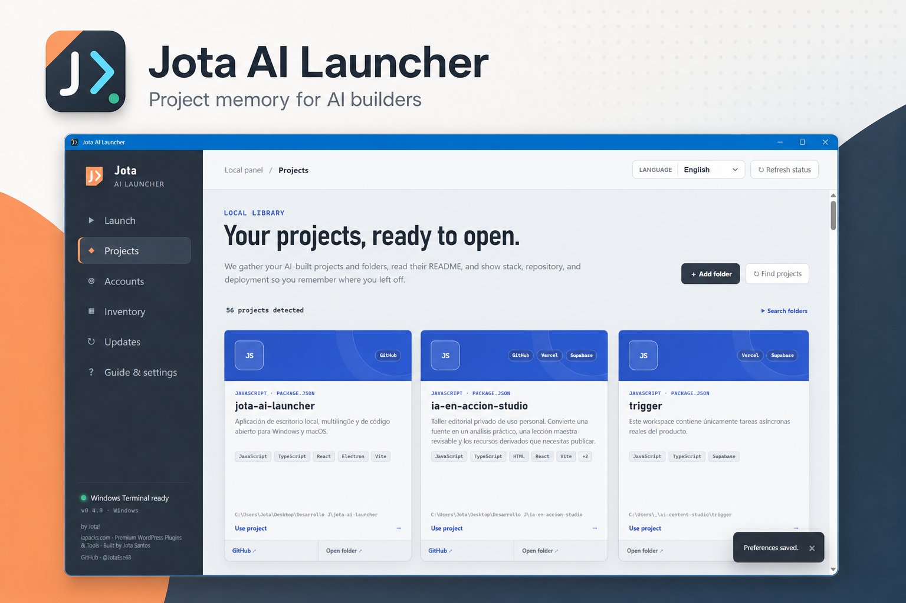
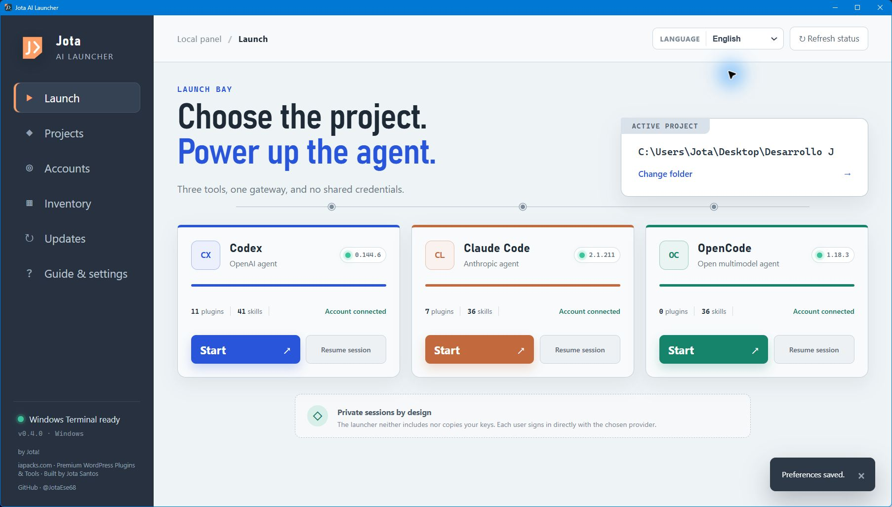
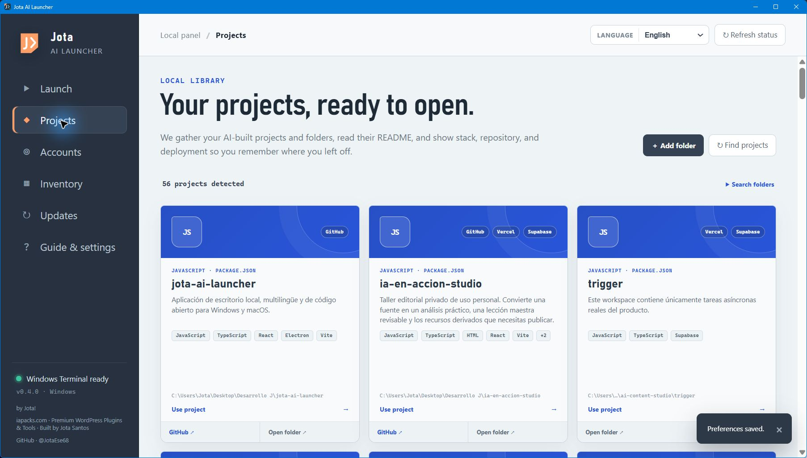
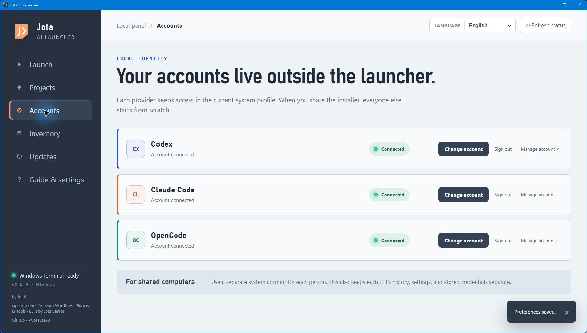
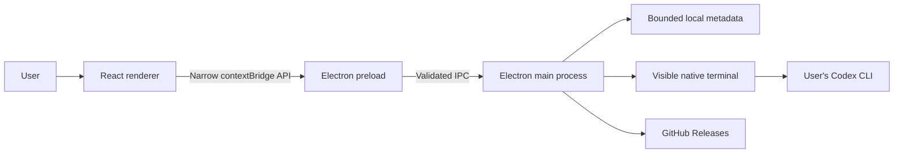

# OpenAI Build Week 2026 · Submission and testing guide

## Project

**Name:** Jota AI Launcher  
**Category:** Developer Tools  
**Creator:** Jota Santos  
**Repository:** [github.com/JotaEse68/jota-ai-launcher](https://github.com/JotaEse68/jota-ai-launcher)  
**Landing page:** [jotaese68.github.io/jota-ai-launcher/en](https://jotaese68.github.io/jota-ai-launcher/en/)  
**Video demo:** [youtu.be/Y2yW0IPqUFc](https://youtu.be/Y2yW0IPqUFc)
**Prebuilt releases:** [github.com/JotaEse68/jota-ai-launcher/releases/latest](https://github.com/JotaEse68/jota-ai-launcher/releases/latest)  
**License:** MIT



## Elevator pitch

Jota AI Launcher is a local desktop command center that remembers every AI-built project, reveals its stack and deployment, and launches Codex with the right context to continue building.

## Inspiration

Jota AI Launcher began with a very ordinary frustration. After creating more and more software with AI, I was spending too much time trying to remember what each folder was, which stack it used, where it had been deployed, which coding agent I used, and how to continue the work.

The first idea was simply to put Codex, Claude Code, and OpenCode behind three friendly buttons. While building it, the real problem became clearer: launching a command was easy; recovering the context of an old project was hard.

That insight changed the product. Jota AI Launcher became a local project-memory layer for people who build many ideas with AI and do not want those ideas to disappear into forgotten folders.

## What it does

Jota AI Launcher provides one desktop interface for installed coding agents and local projects.

- Detects Codex, Claude Code, and OpenCode and reports their installed versions.
- Opens each agent in a visible native terminal inside the selected project.
- Keeps every user's provider accounts and credentials separate from the launcher.
- Inventories accounts, plugins, skills, and MCP servers when supported by each CLI.
- Finds projects in common development folders and user-approved locations.
- Extracts a short purpose statement from the README or project metadata.
- Recognizes languages, frameworks, databases, hosting providers, and GitHub remotes.
- Includes WordPress plugins, designs, prototypes, and local AI-assisted work even when there is no Git repository.
- Supports Spanish, English, French, Portuguese, Italian, and German.
- Ships as a Windows installer and a universal macOS package.

All project discovery happens locally. The launcher reads bounded metadata such as README excerpts, manifest files, filenames, and Git remotes. It does not upload a user's projects to a Jota-owned server.







## How Codex and GPT-5.6 were used

The application was built collaboratively by Jota Santos and Codex using **GPT-5.6 Sol with high reasoning** during the Build Week submission period.

Jota supplied the original problem, product direction, requested capabilities, supported languages, trust requirements, and acceptance decisions. Codex helped turn that direction into a working and distributable product.

Codex and GPT-5.6 contributed to:

1. Breaking the product into safe, incremental releases.
2. Selecting Electron, React, TypeScript, Vite, and electron-builder for a cross-platform local desktop architecture.
3. Implementing CLI detection, authentication-status checks, version checks, visible terminal launch, and resuming sessions.
4. Designing the renderer/preload/main-process trust boundary and validating IPC, paths, actions, and external URLs.
5. Building the multilingual interface and local project library.
6. Designing heuristics for README summaries, stack detection, GitHub remotes, deployment providers, and non-Git projects.
7. Writing regression tests, strict TypeScript checks, CI, CodeQL, dependency auditing, release automation, SBOM creation, checksums, and provenance attestations.
8. Investigating and correcting a CodeQL finding involving deceptive URL matches, then adding adversarial tests for the corrected policy.
9. Writing the bilingual documentation, security review, download-verification instructions, and landing page.
10. Inspecting the packaged application and public pages to catch visual and release issues before publication.

GPT-5.6 was most valuable when a request affected product design, local operating-system behavior, security, testing, documentation, and distribution at the same time. Its role was not to generate an isolated prototype, but to maintain coherence while the product expanded rapidly.

The launcher itself does not make a hidden GPT-5.6 API call. It is a developer tool built with GPT-5.6 that launches the user's own Codex installation at runtime. This distinction is intentional and keeps authentication under the control of the official CLI.

## Devpost submission checklist

The repository supports the public judging path, but the final Devpost entry still requires a manual submission. Before submitting, confirm that the entry includes:

- The **Developer Tools** category, an English description, and this public repository URL.
- The public YouTube demo link above; the video is under three minutes and includes audio.
- The `/feedback` Codex Session ID for the primary build thread where most core functionality was created.
- The platform and installation instructions judges should use to run the project.

The session ID belongs in Devpost and is intentionally not stored in this repository or in the application.

## Technical architecture



The renderer has no direct Node.js access. Electron context isolation and sandboxing are enabled. The main process accepts only known tools and actions, checks the sender of every IPC request, restricts project paths to approved locations, and opens only allowlisted HTTPS domains.

## Challenges

### Keeping a desktop launcher safe

A launcher must interact with the operating system, local folders, terminals, and external tools. The difficult part was exposing enough capability to be useful without giving the renderer arbitrary command or filesystem access. The final architecture uses a narrow preload bridge, allowlisted actions, validated paths, visible terminals, denied web permissions, and restricted navigation.

### Finding useful context without indexing source code

The project library needed to explain a project without behaving like a cloud code-indexing service. It therefore reads only bounded metadata and uses conservative heuristics. Generated folders are skipped, symbolic links cannot escape approved roots, and the scan has depth and result limits.

### Supporting projects that are not conventional repositories

Many AI-assisted projects begin as local folders, WordPress plugins, design files, or experiments. Requiring Git would hide exactly the work the launcher is meant to remember. The detector therefore recognizes useful local work without assuming that every project has a repository or formal stack.

### Building trust in downloadable desktop software

The installers are not yet commercially signed. Instead of making an unrealistic “malware-free” promise, the project publishes source code, CI results, CodeQL analysis, SHA-256 checksums, CycloneDX SBOMs, provenance attestations, a security policy, and independent scanning guidance.

## Accomplishments

- Progressed from an idea to six public releases during the Build Week period.
- Produced working Windows and macOS packages from the same codebase.
- Built a six-language desktop interface and bilingual public landing page.
- Turned project discovery into a useful memory system rather than a folder list.
- Kept the launcher free of embedded accounts, passwords, API keys, analytics, and proprietary backend services.
- Completed a security hardening pass and resolved the CodeQL finding before release.
- Published reproducible release evidence for judges and users.

## What I learned

The most important lesson was that the visible request is not always the real problem. “Open Codex with a button” sounded like the product, but the deeper need was to recover context across many AI-built projects.

I also learned that trust is part of the product. For desktop software, a polished interface is not enough: users need to know what is read, what is executed, where credentials live, and how a binary can be independently verified.

Finally, working with Codex was most effective as an iterative product conversation. Small requests exposed larger needs, and each layer was validated before the next one was added.

## What's next

- A “Project Rescue” handoff that asks Codex to summarize the current state and propose the next safe steps for an approved project.
- Commercial code signing and Apple notarization.
- Optional user-authored notes and project status without uploading data.
- More stack and deployment detectors.
- Import and export of the local project catalog.

## Test without rebuilding

No shared credentials or API keys are required.

### Windows

1. Download [`Jota-AI-Launcher-Setup-0.5.0.exe`](https://github.com/JotaEse68/jota-ai-launcher/releases/download/v0.5.0/Jota-AI-Launcher-Setup-0.5.0.exe).
2. Optionally download `SHA256SUMS.txt` from the same release and verify the installer.
3. Run the installer and open Jota AI Launcher.
4. Open **Projects** and add a folder that contains development projects.
5. Inspect the detected descriptions, stacks, repositories, and deployment services.
6. If Codex CLI is installed and authenticated, select a project and launch Codex.

### macOS

1. Download [`Jota-AI-Launcher-0.5.0-universal.dmg`](https://github.com/JotaEse68/jota-ai-launcher/releases/download/v0.5.0/Jota-AI-Launcher-0.5.0-universal.dmg).
2. Open the DMG and move Jota AI Launcher to Applications.
3. Complete the same project-library test described for Windows.

The packages are currently unsigned, so the operating system may display a first-run warning. The [verification guide](./VERIFICAR.md) explains the checksums and GitHub provenance path.

## Rebuild and verify

```shell
git clone https://github.com/JotaEse68/jota-ai-launcher.git
cd jota-ai-launcher
npm ci
npm test
npm run build
```

The main repository README contains the complete development, packaging, privacy, and security instructions.

## Public timeline and evidence

The first commit was created on July 18, 2026, after the Build Week submission period opened.

| Release | Build Week result |
|---|---|
| `v0.1.0` | Secure Windows launcher and first public release |
| `v0.2.0` | Six languages and universal macOS support |
| `v0.3.0` | Visual local project library |
| `v0.3.1` | Complete bilingual documentation and security review |
| `v0.4.0` | Project memory, stack and hosting detection, local non-Git projects, and bilingual landing |
| `v0.5.0` | Finish desk, project search, focus planning, session checkpoints, and intentional project closure |

Evidence is available in the [commit history](https://github.com/JotaEse68/jota-ai-launcher/commits/main/), [pull requests](https://github.com/JotaEse68/jota-ai-launcher/pulls?q=is%3Apr+is%3Aclosed), [releases](https://github.com/JotaEse68/jota-ai-launcher/releases), and [GitHub Actions](https://github.com/JotaEse68/jota-ai-launcher/actions).

## Privacy and ownership

Jota AI Launcher is original work directed by Jota Santos and released under the MIT License. Third-party coding agents are not bundled. Their names identify optional interoperable tools, and each provider retains control of its own software, services, authentication, and trademarks.

The project contains no user credentials, private project data, or copied third-party source code.
