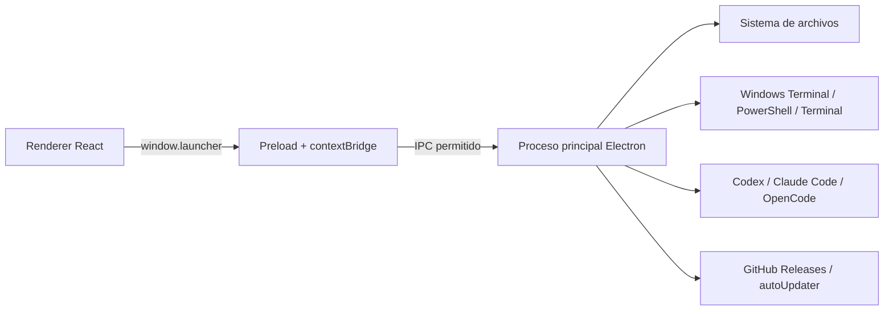
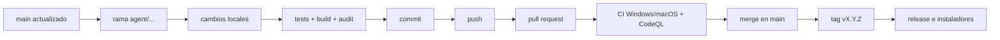

# Cómo construimos Jota AI Launcher con Codex

> Memoria completa del proceso de producto, diseño, desarrollo, seguridad y publicación de Jota AI Launcher.

**Proyecto:** Jota AI Launcher  
**Repositorio:** [github.com/JotaEse68/jota-ai-launcher](https://github.com/JotaEse68/jota-ai-launcher)  
**Landing:** [jotaese68.github.io/jota-ai-launcher](https://jotaese68.github.io/jota-ai-launcher/)  
**Última versión documentada:** `v0.4.0`  
**Periodo reconstruido:** 18 y 19 de julio de 2026  
**Autor y dirección de producto:** Jota Santos  
**Desarrollo asistido:** Codex

---

## 1. Qué documenta este archivo

Este documento registra cómo nació Jota AI Launcher, qué problema queríamos resolver, cómo fuimos ampliando la idea, qué arquitectura elegimos, cómo se construyó cada parte y qué controles utilizamos antes de publicar los instaladores.

No es una transcripción literal de todos los mensajes de la conversación. Es una reconstrucción técnica y de producto contrastada con:

- el historial real de Git;
- los tags y releases publicados;
- el código fuente actual;
- los pull requests y workflows de GitHub;
- las pruebas automatizadas;
- las capturas y revisiones visuales realizadas durante el desarrollo.

La intención es que sirva a la vez como:

1. memoria del proyecto;
2. guía para entender su arquitectura;
3. registro de cómo trabajamos Jota y Codex;
4. manual para continuar desarrollándolo sin perder contexto;
5. ejemplo de creación de una aplicación real mediante desarrollo asistido por IA.

---

## 2. El problema original

El proyecto nació de una situación muy concreta: usar varias herramientas de programación con IA desde PowerShell obligaba a recordar demasiadas cosas antes de empezar.

Había que recordar:

- qué comando abría Codex;
- qué comando abría Claude Code;
- cómo iniciar OpenCode;
- en qué carpeta estaba cada proyecto;
- qué herramienta estaba instalada y qué versión tenía;
- con qué cuenta estaba conectada cada CLI;
- qué plugins, skills o servidores MCP estaban disponibles;
- cómo retomar una sesión anterior;
- dónde descargar una herramienta que faltaba;
- qué proyecto estaba en GitHub, Vercel, Netlify, Render o únicamente en local.

El problema no era solo lanzar un comando. El problema era la pérdida de contexto al acumular proyectos creados con IA.

La idea inicial se convirtió en esta frase de producto:

> Elegir el proyecto, elegir el agente y empezar a trabajar sin tener que reconstruir mentalmente todo el entorno.

---

## 3. Cómo evolucionó la petición

La aplicación no se definió entera en un único mensaje. Se construyó por capas, mediante peticiones sucesivas.

### Primera capa: un lanzador de agentes

La primera necesidad fue una aplicación de escritorio llamada **Jota AI Launcher** capaz de abrir desde botones:

- Codex;
- Claude Code;
- OpenCode.

Cada herramienta debía utilizar sus propias cuentas y credenciales. Compartir el instalador no podía compartir las cuentas del creador.

### Segunda capa: inventario y mantenimiento

Después se añadió la necesidad de ver:

- si cada CLI estaba instalada;
- su versión;
- el estado general de autenticación;
- plugins;
- skills;
- servidores MCP;
- actualizaciones disponibles.

### Tercera capa: confianza y distribución

Como una aplicación de escritorio actúa dentro del sistema operativo, surgió una preocupación legítima: cómo transmitir confianza a quien descarga el instalador.

Esto llevó a incorporar:

- repositorio público;
- licencia MIT;
- README detallado;
- política de privacidad;
- política de seguridad;
- hashes SHA-256;
- SBOM;
- atestaciones de procedencia de GitHub;
- auditoría de dependencias;
- CodeQL;
- workflows reproducibles.

### Cuarta capa: idiomas y sistemas operativos

El launcher pasó de ser una aplicación para Windows a admitir:

- Windows 10/11 x64;
- macOS Intel y Apple Silicon mediante paquete universal.

La interfaz se tradujo a:

- español;
- inglés;
- francés;
- portugués;
- italiano;
- alemán.

### Quinta capa: biblioteca de proyectos

Se añadió una biblioteca capaz de encontrar proyectos locales y convertirlos en tarjetas clicables para:

- seleccionarlos como proyecto activo;
- abrir su carpeta;
- iniciar el agente dentro de esa ubicación.

### Sexta capa: memoria de proyectos

La biblioteca evolucionó para responder una pregunta más importante:

> “¿Para qué era este proyecto, con qué estaba hecho y dónde lo había publicado?”

Desde `v0.4.0`, cada tarjeta puede mostrar:

- descripción extraída del README;
- tecnologías y frameworks;
- GitHub;
- Vercel, Netlify, Render, Railway o Cloudflare;
- Supabase, Firebase y Docker;
- proyectos o plugins que solo existen como carpetas locales.

### Séptima capa: landing pública

Finalmente se creó una landing sin venta agresiva, orientada a vibe coders y personas que desarrollan con IA. Se publicó en español e inglés mediante GitHub Pages.

---

## 4. Reparto de responsabilidades entre Jota y Codex

El proyecto fue colaborativo, pero las responsabilidades fueron diferentes.

| Área | Jota | Codex |
|---|---|---|
| Problema | Explicó la dificultad real y los casos de uso | Convirtió el problema en requisitos implementables |
| Producto | Decidió nombre, agentes, idiomas, enlaces, tono y prioridades | Organizó las funciones por versiones y flujos |
| Diseño | Marcó la necesidad de una app cercana y fácil | Diseñó la interfaz, componentes, tarjetas y landing |
| Arquitectura | Aprobó el alcance de escritorio y distribución | Eligió Electron, React, TypeScript, Vite y electron-builder |
| Implementación | Revisó resultados y pidió ampliaciones | Escribió y modificó el código, scripts, tests y workflows |
| Seguridad | Pidió una revisión profesional y confianza para el usuario | Auditó superficies, endureció Electron/IPC y corrigió CodeQL |
| GitHub | Autorizó publicar y fusionar | Creó ramas, commits, PR, tags, releases y Pages |
| Validación | Confirmó la dirección funcional | Ejecutó builds, pruebas, auditorías y revisiones visuales |

Codex no decidió por sí solo el producto. La dirección surgió de las necesidades expresadas por Jota; Codex las transformó en diseño, código, pruebas y operaciones reproducibles.

---

## 5. Elección del stack

### Electron

Se eligió Electron porque la aplicación necesitaba:

- interfaz visual de escritorio;
- acceso controlado al sistema de archivos;
- abrir terminales nativas;
- detectar comandos instalados;
- funcionar en Windows y macOS;
- generar instaladores compartibles;
- incorporar actualización automática.

### React

React se utilizó para construir la interfaz por vistas y componentes:

- lanzamiento;
- proyectos;
- cuentas;
- inventario;
- actualizaciones;
- ayuda y ajustes.

### TypeScript estricto

TypeScript permitió definir contratos compartidos entre el proceso principal y la interfaz. Se activó el modo `strict` tanto para Electron como para el renderer.

### Vite

Vite sirve la interfaz durante el desarrollo y genera el bundle de producción dentro de `dist/renderer`.

### electron-builder

Se utilizó para producir:

- instalador NSIS `.exe` para Windows;
- `.dmg` universal para macOS;
- `.zip` universal para el canal de actualización de macOS;
- archivos `.blockmap` y metadatos `latest.yml` / `latest-mac.yml`.

### GitHub Actions y GitHub Pages

GitHub Actions valida y empaqueta el proyecto. GitHub Pages publica la landing estática bilingüe.

---

## 6. Árbol de trabajo final

El árbol no se creó de una sola vez. Comenzó con la aplicación y fue incorporando documentación, seguridad, publicación, biblioteca y landing.

```text
jota-ai-launcher/
├─ .github/
│  ├─ dependabot.yml
│  └─ workflows/
│     ├─ ci.yml                 # Tests, build, landing y npm audit
│     ├─ codeql.yml             # Análisis de seguridad JS/TS
│     ├─ pages.yml              # Publicación de la landing
│     └─ release.yml            # Instaladores Windows/macOS
├─ build/
│  ├─ icon.svg                  # Fuente del icono
│  ├─ icon.png                  # Icono para macOS
│  └─ icon.ico                  # Icono para Windows
├─ docs/
│  ├─ PROCESO-DE-CREACION.md    # Este documento
│  ├─ SECURITY-REVIEW.md        # Revisión técnica en español
│  ├─ SECURITY-REVIEW.en.md     # Revisión técnica en inglés
│  └─ VERIFICAR.md              # Verificación de instaladores
├─ scripts/
│  ├─ build-icon.mjs            # Genera PNG e ICO desde el SVG
│  ├─ check-site.mjs            # Valida la landing
│  └─ site-url-policy.mjs       # Compara URLs públicas exactas
├─ site/
│  ├─ .nojekyll
│  ├─ assets/
│  │  ├─ launcher-home.png
│  │  └─ projects-library.png
│  ├─ en/
│  │  └─ index.html             # Landing inglesa
│  ├─ index.html                # Landing española
│  ├─ robots.txt
│  ├─ sitemap.xml
│  └─ styles.css
├─ src/
│  ├─ main/
│  │  ├─ definitions.ts         # Registro de Codex/Claude/OpenCode
│  │  ├─ localization.ts        # Textos del proceso principal
│  │  ├─ main.ts                # Ventana, seguridad e IPC
│  │  ├─ preload.ts             # API limitada para el renderer
│  │  └─ services.ts            # Detección, inventario, proyectos y terminal
│  ├─ renderer/
│  │  ├─ App.tsx                # Vistas y estado de React
│  │  ├─ global.d.ts            # Tipado de window.launcher
│  │  ├─ i18n.ts                # Seis idiomas
│  │  ├─ index.html             # CSP y raíz del renderer
│  │  ├─ main.tsx               # Entrada de React
│  │  └─ styles.css             # Sistema visual de la aplicación
│  └─ shared/
│     └─ types.ts               # Contratos compartidos e IPC
├─ tests/
│  └─ launcher.test.cjs         # Pruebas de regresión
├─ LICENSE
├─ PRIVACY.md
├─ README.md
├─ README.en.md
├─ SECURITY.md
├─ package.json
├─ package-lock.json
├─ tsconfig.main.json
├─ tsconfig.renderer.json
└─ vite.config.ts
```

Directorios generados que no forman parte del código fuente versionado:

```text
dist/       # JavaScript y renderer compilados
release/    # Instaladores y metadatos generados localmente
node_modules/
```

---

## 7. Arquitectura de ejecución

Electron separa la aplicación en tres capas.



### Renderer

El renderer muestra la interfaz, pero no puede acceder directamente a Node.js ni ejecutar comandos del sistema.

### Preload

`preload.ts` publica una API limitada llamada `window.launcher`. Solo expone operaciones conocidas:

- escanear herramientas;
- leer y guardar ajustes;
- seleccionar carpetas mediante diálogo nativo;
- escanear proyectos;
- abrir una carpeta autorizada;
- ejecutar una acción permitida;
- abrir un enlace permitido;
- comprobar actualizaciones del launcher.

### Proceso principal

`main.ts` recibe las peticiones IPC, comprueba el emisor, valida rutas y acciones, y realiza las operaciones del sistema.

Este reparto fue esencial: la interfaz puede pedir una acción, pero no decidir libremente qué comando arbitrario ejecutar.

---

## 8. Construcción inicial de la aplicación

### Paso 1. Crear el proyecto y las dependencias

Se preparó un proyecto Node con Electron, React, TypeScript y Vite. El archivo `package.json` quedó como fuente principal de scripts y empaquetado.

Scripts fundamentales:

```shell
npm run dev
npm run typecheck
npm test
npm run build
npm run dist:win
npm run dist:mac
```

### Paso 2. Crear el registro de herramientas

En `src/main/definitions.ts` se definió un registro único para los tres agentes. Cada entrada contiene:

- identificador;
- nombre visible;
- comando;
- paquete npm oficial;
- color de interfaz;
- documentación;
- descarga;
- gestión de cuenta.

Esto evita repartir URLs y nombres por toda la aplicación.

### Paso 3. Detectar si cada CLI está instalada

El proceso principal comprueba si existen los comandos:

```text
codex
claude
opencode
```

En Windows usa `where.exe`. En macOS utiliza `command -v` dentro de `zsh`.

### Paso 4. Consultar versión y autenticación

Cuando una herramienta está disponible, se ejecutan comandos de diagnóstico como:

```text
codex --version
codex login status
claude --version
claude auth status
opencode --version
opencode auth list
```

El launcher no lee tokens ni contraseñas. Interpreta únicamente el estado general publicado por cada CLI.

### Paso 5. Abrir las acciones en una terminal visible

Se creó una matriz fija de acciones:

| Herramienta | Iniciar | Continuar | Login | Actualizar |
|---|---|---|---|---|
| Codex | `codex` | `codex resume` | `codex login` | `codex update` |
| Claude Code | `claude` | `claude --resume` | `claude auth login` | `claude update` |
| OpenCode | `opencode` | `opencode --continue` | `opencode auth login` | `opencode upgrade --method npm` |

Si la herramienta falta, se ofrece su instalación mediante el paquete npm oficial.

En Windows se prioriza Windows Terminal y se utiliza PowerShell como alternativa. En macOS se abre Terminal mediante AppleScript. La terminal se inicia en la carpeta del proyecto seleccionada.

### Paso 6. Persistir preferencias locales

Los ajustes se guardan en `settings.json` dentro de la carpeta de datos del usuario de Electron. Incluyen:

- proyecto activo;
- idioma;
- comprobación de herramientas;
- comprobación de actualizaciones;
- inicio con el sistema;
- raíces personalizadas de proyectos.

No se guardan claves API, contraseñas ni sesiones de los agentes.

---

## 9. Diseño de la interfaz

La interfaz se diseñó como un panel de control de herramientas de desarrollo, no como una tienda ni un chat.

### Identidad visual

Se utilizaron:

- fondo gris azulado;
- sidebar grafito;
- azul cobalto para acciones principales;
- naranja albaricoque como firma de Jota;
- verde para estados correctos;
- tipografías del sistema, Bahnschrift y Cascadia Mono.

### Vistas

#### Lanzar

Muestra el proyecto activo y las tres tarjetas de agentes.

#### Proyectos

Muestra la biblioteca local y permite seleccionar, abrir o enlazar cada proyecto.

#### Cuentas

Muestra si cada CLI informa de una cuenta conectada y abre sus acciones oficiales de login/logout.

#### Inventario

Agrupa plugins, skills y servidores MCP.

#### Actualizaciones

Compara versiones instaladas, consulta npm y permite abrir las actualizaciones oficiales.

#### Guía y ajustes

Explica el flujo de uso y contiene preferencias locales.

### Icono

Se creó una marca `J›` y un script con Sharp para producir los formatos utilizados por Windows y macOS.

---

## 10. Cuentas propias y aplicación compartible

Una decisión importante fue no crear un panel que almacenara claves de OpenAI, Anthropic o proveedores de OpenCode.

El modelo elegido fue:

1. el launcher detecta la CLI;
2. la persona pulsa iniciar sesión;
3. se abre una terminal visible;
4. la CLI oficial gestiona su autenticación;
5. las credenciales permanecen en el perfil del usuario y bajo el control de esa herramienta.

Por eso, al compartir el instalador:

- no se comparten las cuentas de Jota;
- no se incluyen contraseñas;
- no se incluyen claves API;
- cada persona conecta sus propios proveedores.

---

## 11. Inventario de plugins, skills y MCP

El launcher consulta los comandos públicos de cada CLI y también inspecciona carpetas de skills conocidas.

Ejemplos:

```text
codex plugin list --json
codex mcp list
claude plugin list --json
claude mcp list
opencode mcp list
```

Raíces de skills consideradas:

```text
~/.agents/skills
~/.codex/skills
~/.claude/skills
~/.config/opencode/skills
~/.config/opencode/plugins
```

Las consultas extensas se realizan cuando se solicita una comprobación completa, para que el arranque rápido no tenga que esperar todos los comandos.

---

## 12. Traducción a seis idiomas y soporte macOS

En `v0.2.0` se separaron los textos del renderer y del proceso principal.

`src/renderer/i18n.ts` contiene las traducciones de la interfaz. `src/main/localization.ts` contiene los textos necesarios fuera de React, como títulos de diálogos o resultados de acciones.

El idioma inicial se toma de la configuración regional del sistema y se normaliza a uno de los seis idiomas admitidos.

Para macOS se añadió:

- detección de plataforma;
- apertura de Terminal;
- empaquetado universal;
- generación de `.dmg` y `.zip`;
- workflow en runner macOS;
- metadatos para actualización automática.

---

## 13. Primera biblioteca visual de proyectos

La biblioteca apareció en `v0.3.0`.

### Objetivo inicial

Encontrar proyectos en carpetas habituales y mostrar tarjetas para abrirlos sin tener que navegar manualmente por el disco.

### Marcadores principales

| Ecosistema | Marcador |
|---|---|
| JavaScript | `package.json` |
| Python | `pyproject.toml`, `requirements.txt` |
| Rust | `Cargo.toml` |
| Go | `go.mod` |
| PHP | `composer.json` |
| Ruby | `Gemfile` |
| .NET | `.sln`, `.csproj` |
| Git | `.git` |

### Raíces automáticas

La aplicación busca en ubicaciones habituales como:

```text
Desktop/Desarrollo J
Desktop/Development
Desktop/Projects
Documents/GitHub
Documents/Projects
~/Developer
~/Projects
~/dev
~/source/repos
```

También se pueden añadir hasta 25 raíces personalizadas mediante un diálogo nativo.

### Carpetas omitidas

Para no confundir dependencias o builds con proyectos se omiten, entre otras:

```text
node_modules
dist
build
release
.next
.nuxt
.venv
venv
vendor
target
coverage
.git
```

---

## 14. De biblioteca a memoria de proyectos

La mejora principal de `v0.4.0` fue dejar de mostrar únicamente nombres y rutas.

### Descripción

El detector busca el primer párrafo útil del README, elimina sintaxis Markdown y limita el resumen a aproximadamente 230 caracteres.

Orden de prioridad:

1. README;
2. descripción de `package.json`;
3. cabecera `Description` de un plugin WordPress.

### Tecnologías

Además del lenguaje principal, se reconocen dependencias y archivos asociados a:

- TypeScript;
- React;
- Next.js;
- Vue;
- Nuxt;
- Svelte y SvelteKit;
- Astro;
- Electron;
- Vite;
- Tailwind CSS;
- Express;
- NestJS;
- Prisma;
- Drizzle;
- Supabase;
- Firebase;
- WordPress;
- HTML y CSS;
- archivos de diseño.

### Servicios

La tarjeta puede indicar:

- GitHub;
- Vercel;
- Netlify;
- Render;
- Railway;
- Cloudflare;
- Docker;
- Supabase.

### Repositorio GitHub

La URL se obtiene desde:

1. `repository` de `package.json`;
2. `homepage` de `package.json`;
3. el remoto de `.git/config`.

Solo se normalizan URLs válidas de `github.com`.

### Proyectos sin Git

Una carpeta puede aparecer aunque no tenga Git ni un manifiesto si contiene elementos significativos:

- README;
- código;
- plugin PHP;
- HTML;
- archivos de diseño;
- otros formatos reconocibles.

Esto permite tener control sobre plugins, prototipos, apps pequeñas, recursos creados con IA y proyectos todavía no publicados.

### Límites y seguridad del escaneo

- profundidad automática máxima de tres niveles en la biblioteca completa;
- máximo de 250 proyectos por operación de descubrimiento;
- lecturas de texto acotadas por tamaño;
- no se indexa el código fuente;
- no se sigue un enlace simbólico que salga de la raíz autorizada;
- la información no se envía a Jota ni a un backend.

---

## 15. Construcción de la landing bilingüe

La landing se diseñó como una explicación cercana para personas que desarrollan con IA.

### Mensaje central

```text
Elige el proyecto.
Enciende el agente.
```

### Estructura narrativa

1. presentación del problema;
2. historia de por qué se creó;
3. beneficios concretos;
4. proceso de uso;
5. biblioteca local;
6. para quién resulta útil;
7. seguridad y confianza;
8. descarga y código fuente;
9. firma y enlaces de autor.

### Idiomas

- español en `/`;
- inglés en `/en/`;
- selector visible en la cabecera;
- `hreflang`, canonical, sitemap y datos estructurados.

### Publicación

El contenido de `site/` se valida y se publica mediante `.github/workflows/pages.yml`.

URL final:

- [Español](https://jotaese68.github.io/jota-ai-launcher/)
- [English](https://jotaese68.github.io/jota-ai-launcher/en/)

---

## 16. Seguridad profesional

La revisión de seguridad no se limitó a ejecutar un antivirus. Se revisó el modelo de confianza completo.

### Aislamiento de Electron

Configuración aplicada:

```text
nodeIntegration: false
contextIsolation: true
sandbox: true
webSecurity: true
allowRunningInsecureContent: false
webviewTag: false
```

Además:

- DevTools se desactiva en la aplicación empaquetada;
- se deniegan nuevas ventanas;
- se bloquea la navegación del renderer;
- se bloquea `webview`;
- se deniegan permisos web;
- se utiliza CSP.

### IPC

Cada handler comprueba que el mensaje procede de la ventana principal. Las herramientas y acciones se validan contra listas permitidas.

### Rutas

Las rutas se convierten a rutas reales, se comprueba que sean directorios y se guardan como capacidades aprobadas. Una ruta recibida desde la interfaz no se utiliza si antes no fue seleccionada o detectada de forma controlada.

### Enlaces

Los enlaces externos deben usar HTTPS y pertenecer a una lista de dominios conocidos.

### Credenciales

No hay formularios de claves API ni secretos embebidos en el código o el instalador.

### Cadena de suministro

- `package-lock.json` fija las dependencias;
- Dependabot revisa npm y GitHub Actions;
- las acciones se fijan por SHA completo;
- CI ejecuta `npm audit --audit-level=high`;
- CodeQL analiza JavaScript y TypeScript;
- las releases incluyen SBOM;
- GitHub genera atestaciones de procedencia.

### Hallazgo de CodeQL durante `v0.4.0`

CodeQL detectó una comparación incompleta de URL en el validador de la landing. Se estaba buscando `https://jsantos.pro/` como una subcadena, lo que teóricamente podía aceptar un dominio engañoso.

La corrección fue:

1. analizar el valor mediante `new URL()`;
2. normalizarlo;
3. exigir coincidencia exacta;
4. añadir pruebas contra subdominios falsos, query strings engañosas, credenciales incrustadas y esquema `javascript:`;
5. repetir CodeQL antes del merge.

El segundo análisis pasó correctamente.

---

## 17. Pruebas automatizadas

La suite actual verifica seis comportamientos:

1. existen exactamente los tres agentes y no contienen credenciales embebidas;
2. se descubren proyectos reales y se omiten dependencias;
3. la URL del autor debe ser exacta y se rechazan dominios engañosos;
4. se extraen README, stack, repositorio y hosting, y se incluyen plugins locales;
5. los ajustes no confiables se normalizan y las rutas inválidas se descartan;
6. el diagnóstico general mantiene una estructura estable.

Comandos de validación utilizados:

```shell
npm run typecheck
npm test
npm run build
npm run site:check
npm audit --audit-level=high
git diff --check
```

Durante la publicación de `v0.4.0`:

- las seis pruebas pasaron;
- Windows CI pasó;
- macOS CI pasó;
- CodeQL pasó;
- npm audit informó de cero vulnerabilidades altas conocidas;
- la landing respondió correctamente en español e inglés.

---

## 18. Revisión visual

Codex no se limitó a compilar el proyecto. También se abrió la aplicación real para capturar y revisar:

- el dashboard principal;
- la biblioteca de proyectos;
- las tarjetas con descripciones, tecnologías y servicios;
- el comportamiento responsive de la landing;
- la versión inglesa;
- desbordamientos horizontales en móvil.

La captura pública de la biblioteca se actualizó después de completar las nuevas tarjetas.

---

## 19. Git y flujo de publicación

El proceso utilizado para cambios importantes fue:



Ejemplos de ramas utilizadas:

```text
agent/project-memory-landing
agent/v0.4.0-release-docs
```

Pull requests relevantes:

- [PR #7 · endurecimiento de seguridad](https://github.com/JotaEse68/jota-ai-launcher/pull/7)
- [PR #8 · memoria de proyectos y landing](https://github.com/JotaEse68/jota-ai-launcher/pull/8)
- [PR #9 · documentación de la release 0.4.0](https://github.com/JotaEse68/jota-ai-launcher/pull/9)

---

## 20. Cronología real de versiones

Todos los tags siguientes se crearon el 18 de julio de 2026.

| Versión | Hora local del tag | Resultado principal |
|---|---:|---|
| `v0.1.0` | 08:56 | Primera aplicación Windows, seguridad básica y release pública |
| `v0.2.0` | 16:34 | Windows + macOS y seis idiomas |
| `v0.3.0` | 17:17 | Biblioteca visual de proyectos |
| `v0.3.1` | 20:29 | README completo, auditoría de seguridad y enlaces profesionales |
| `v0.4.0` | 22:47 | Memoria de proyectos, carpetas locales, stack/hosting y landing bilingüe |

Commits principales en orden:

```text
0513253  Crea Jota AI Launcher para Windows
6da7a54  Publica verificaciones de seguridad y releases
b5d1f00  Add multilingual UI and macOS support
7cb4acf  Add visual project library
eac293b  Add complete bilingual README
d5d0956  Harden launcher security and add author links
0a9d5aa  Harden launcher security and add professional author links (#7)
cce9780  Add project memory library and bilingual landing (#8)
9f74e57  Prepare v0.4.0 release documentation (#9)
```

También se integraron actualizaciones automáticas de dependencias mediante los PR #1, #2 y #3.

---

## 21. Cómo se genera una release

La publicación se activa al subir un tag `v*`.

Ejemplo:

```shell
git tag -a v0.4.0 -m "Jota AI Launcher v0.4.0"
git push origin v0.4.0
```

El workflow realiza tres trabajos.

### Windows

1. checkout;
2. Node 24;
3. `npm ci`;
4. pruebas;
5. build NSIS;
6. SBOM CycloneDX;
7. atestación;
8. subida de artefactos.

### macOS

1. checkout;
2. Node 24;
3. `npm ci`;
4. pruebas;
5. build universal DMG/ZIP;
6. atestación;
7. subida de artefactos.

### Publicación

1. descarga los artefactos de ambos sistemas;
2. genera `SHA256SUMS.txt`;
3. crea la release de GitHub;
4. adjunta binarios y metadatos.

Artefactos publicados en `v0.4.0`:

```text
Jota-AI-Launcher-Setup-0.4.0.exe
Jota-AI-Launcher-Setup-0.4.0.exe.blockmap
Jota-AI-Launcher-0.4.0-universal.dmg
Jota-AI-Launcher-0.4.0-universal.dmg.blockmap
Jota-AI-Launcher-0.4.0-universal.zip
Jota-AI-Launcher-0.4.0-universal.zip.blockmap
latest.yml
latest-mac.yml
sbom.cdx.json
SHA256SUMS.txt
```

Release: [Jota AI Launcher v0.4.0](https://github.com/JotaEse68/jota-ai-launcher/releases/tag/v0.4.0)

---

## 22. Actualización automática

La aplicación utiliza `electron-updater` con GitHub Releases como proveedor.

Cuando la aplicación empaquetada se abre y está activada la comprobación automática:

1. espera unos segundos;
2. consulta la última release;
3. compara la versión;
4. utiliza `latest.yml` o `latest-mac.yml`;
5. notifica la actualización según el comportamiento de electron-updater.

También existe una comprobación manual desde la vista **Actualizaciones**.

---

## 23. Cómo reconstruir el proyecto desde cero

### Requisitos

- Git;
- Node.js 24 compatible;
- npm;
- Windows o macOS.

### Clonar

```shell
git clone https://github.com/JotaEse68/jota-ai-launcher.git
cd jota-ai-launcher
```

### Instalar dependencias reproducibles

```shell
npm ci
```

### Desarrollo

```shell
npm run dev
```

Vite sirve React y Electron carga esa URL local.

### Validar

```shell
npm run typecheck
npm test
npm run build
npm run site:check
npm audit --audit-level=high
```

### Ejecutar el build local

```shell
npm start
```

### Crear instalador de Windows

```shell
npm run dist:win
```

### Crear paquetes de macOS

```shell
npm run dist:mac
```

Los resultados se generan en `release/`.

---

## 24. Método de trabajo que seguimos con Codex

El proceso repetido en cada iteración fue:

1. **Explicar el problema real.** Jota describía lo que le costaba recordar o ejecutar.
2. **Inspeccionar el estado actual.** Codex leía la estructura, historial y código antes de cambiar nada.
3. **Convertir la idea en requisitos.** Se separaban interfaz, datos, sistema, seguridad y publicación.
4. **Elegir una solución proporcional.** Se evitaba introducir un backend cuando el problema podía resolverse localmente.
5. **Modificar contratos compartidos.** Primero tipos y modelo, después servicios e interfaz.
6. **Implementar la lógica del proceso principal.** Las operaciones sensibles quedaban fuera de React.
7. **Construir la interfaz.** Se añadían componentes, traducciones y estilos.
8. **Probar localmente.** TypeScript, tests, build, audit y revisión visual.
9. **Revisar seguridad.** IPC, rutas, comandos, enlaces, dependencias y datos leídos.
10. **Documentar.** README, privacidad, seguridad y guía de verificación.
11. **Publicar en una rama.** Commit intencional, push y pull request.
12. **Esperar CI.** No se hacía merge con comprobaciones fallidas.
13. **Corregir hallazgos.** El ejemplo más claro fue la alerta de URL de CodeQL.
14. **Fusionar y etiquetar.** Solo después de tener todo verde.
15. **Verificar el resultado público.** Landing, release y artefactos reales.

Este ciclo fue más importante que escribir código rápidamente. Permitió que cada ampliación mantuviera la estructura profesional del proyecto.

---

## 25. Decisiones que evitamos deliberadamente

### No crear un backend innecesario

El inventario y la biblioteca funcionan localmente. No hacía falta almacenar proyectos en Supabase ni crear cuentas propias del launcher.

### No almacenar claves API

Las cuentas siguen bajo el control de las CLI oficiales.

### No ejecutar comandos enviados libremente por la interfaz

Solo existen acciones fijas y conocidas.

### No afirmar que el instalador es “100 % libre de malware”

Ninguna revisión seria puede prometer invulnerabilidad. Se ofrecen evidencias verificables: código, CI, hashes, SBOM, atestaciones y análisis.

### No confundir una carpeta sin stack con algo inútil

Un plugin, diseño o prototipo local también forma parte del trabajo y puede necesitarse meses después.

---

## 26. Limitaciones y riesgos residuales

- Los instaladores todavía no tienen firma comercial de Microsoft ni notarización de Apple.
- Windows SmartScreen o macOS Gatekeeper pueden mostrar advertencias.
- La detección de stack es heurística; una tarjeta puede no reconocer una tecnología poco habitual.
- El resumen depende de que exista un README o una descripción útil.
- Los agentes se ejecutan con los permisos de la cuenta del sistema.
- La seguridad interna de Codex, Claude Code, OpenCode o sus plugins queda fuera del launcher.
- Una carpeta local puede aparecer sin descripción hasta que se le añada un README.

---

## 27. Cómo continuar el proyecto sin perder el método

Para una nueva función:

1. actualizar `src/shared/types.ts` si cambia el modelo;
2. implementar operaciones sensibles en `src/main/`;
3. exponer solo la mínima API necesaria en `preload.ts`;
4. añadir la vista o control en `App.tsx`;
5. traducir todas las claves en `i18n.ts` y, si corresponde, `localization.ts`;
6. añadir pruebas de regresión;
7. ejecutar todos los checks;
8. revisar privacidad y seguridad;
9. actualizar README/documentación;
10. publicar mediante rama y PR;
11. esperar CI y CodeQL;
12. crear tag únicamente cuando el código de `main` coincida con la versión de `package.json`.

---

## 28. Estado al cerrar esta memoria

Jota AI Launcher `v0.4.0` está:

- fusionado en `main`;
- publicado en GitHub;
- disponible para Windows y macOS;
- traducido a seis idiomas;
- acompañado de landing española e inglesa;
- validado en CI para ambos sistemas;
- analizado con CodeQL;
- distribuido con hashes, SBOM y atestaciones;
- preparado para detectar agentes, cuentas, plugins, skills, MCP y proyectos;
- preparado para recordar el propósito, stack, repositorio y despliegue de proyectos locales.

La mayor evolución del proyecto fue pasar de “tres botones que abren tres CLI” a una herramienta que conserva el contexto de trabajo de una persona que desarrolla muchas ideas con IA.

---

## 29. Enlaces finales

- [Repositorio](https://github.com/JotaEse68/jota-ai-launcher)
- [Última release](https://github.com/JotaEse68/jota-ai-launcher/releases/latest)
- [Landing en español](https://jotaese68.github.io/jota-ai-launcher/)
- [Landing en inglés](https://jotaese68.github.io/jota-ai-launcher/en/)
- [Política de seguridad](../SECURITY.md)
- [Revisión técnica de seguridad](./SECURITY-REVIEW.md)
- [Cómo verificar una descarga](./VERIFICAR.md)
- [Privacidad](../PRIVACY.md)
- [by Jota!](https://jsantos.pro/)
- [iapacks.com](https://iapacks.com/)
- [GitHub de Jota](https://github.com/JotaEse68)

---

**Documento creado para conservar el proceso completo de construcción de Jota AI Launcher con Codex y facilitar sus próximas etapas.**
